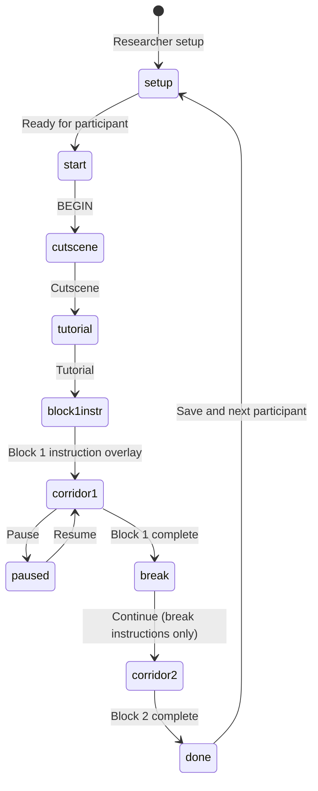

# GLYPHMIND

**GLYPHMIND** is a browser-based **first-person corridor** N-back task. Participants walk an Egyptian-themed hallway; each of **70 paintings** reveals one hieroglyph in visit order. The first **N** paintings are **observe only**; the rest require **MATCH** or **NO MATCH** against the glyph from **N paintings back**.

Offline runtime: open **`index.html`** with **`lib/`** (Three.js, SheetJS) and **`fonts/`** beside it. No build step or network at run time.

---

## Table of contents

1. [Concept overview](#1-concept-overview)
2. [Game mechanics](#2-game-mechanics)
3. [Sequence generation](#3-sequence-generation)
4. [Trial timing and export](#4-trial-timing-and-export)
5. [Participant workflow](#5-participant-workflow)
6. [Research session workflow](#6-research-session-workflow)
7. [Controls and accessibility](#7-controls-and-accessibility)
8. [Stimulus set](#8-stimulus-set)
9. [Data export](#9-data-export)
10. [Technology](#10-technology)
11. [Running locally and validation](#11-running-locally-and-validation)
12. [License](#12-license)

---

## 1. Concept overview

| Layer | Role |
|--------|------|
| **Presentation** | WebGL corridor (Three.js). First-person walk; glyphs reveal at proximity. |
| **Memory** | N-back on **painting order**: current glyph vs glyph **N steps back** in the sequence. |
| **Structure** | **70 paintings** per block; first **N** observe only; **70 − N** scored responses. |

Constants: **`TOTAL_TRIALS = 70`**, **`MATCH_COUNT = 30`**, **`NON_MATCH_PAINTING_COUNT = 40`**.

Each block is exactly **70 paintings** in the corridor and in the export. The first **N** are **observe only** and are **included in those 70**. There is no separate hidden seed or 71st painting.

| Block part | Count | Paintings | Notes |
|------------|------:|-----------|--------|
| Observe-only | **N** | **1 … N** | Watch only; no MATCH / NO MATCH response |
| Scored | **70 − N** | **N+1 … 70** | Compare current glyph to the one **N steps back** |
| True N-back matches (scored) | **30** | among scored rows | Ground truth: `Stimulus === Target` |
| Scored non-matches | **70 − N − 30** | among scored rows | Forced non-match at sequence generation |

**Export accounting (`isMatchPainting`)**: every complete block has **30** rows with `isMatchPainting = 1` and **40** with `isMatchPainting = 0`:

| `isMatchPainting` | Source | Count |
|------------------:|--------|------:|
| **0** | N observe-only rows | N |
| **0** | Scored non-match rows | 70 − N − 30 |
| **0** | **Total non-match rows** | **40** |
| **1** | Scored match rows | **30** |

Examples:

| N | Observe | Scored | Scored matches | Scored non-matches | Export rows (`isMatchPainting`) |
|--:|--------:|-------:|---------------:|-------------------:|--------------------------------|
| 1 | 1 | 69 | 30 | 39 | 30 match + 40 non-match (= 1 + 39) |
| 3 | 3 | 67 | 30 | 37 | 30 match + 40 non-match (= 3 + 37) |

Observe-only rows always log **`isMatchPainting = 0`** (they are not N-back trials). For match/non-match analysis, filter **`trialType === "scored"`** or use **`CRESP`**.

---

## 2. Game mechanics

### 2.1 Trial flow

Paintings are indexed **0 … 69** internally (**1 … 70** in export).


### 2.2 N-back rule (scored paintings only)

For scored painting index **i** (where **i ≥ N**):

- **Current:** `seq[i]`
- **Compare to:** `seq[i − N]`
- **MATCH** if equal, **NO MATCH** if different.

Observe paintings **1 … N** seed the chain; they are visible in the corridor but do not take a response.

### 2.3 Responses

| Action | Code | Desktop |
|--------|------|---------|
| MATCH | `Resp = 1` | left click |
| NO MATCH | `Resp = 2` | right click |

**CRESP** follows ground truth; **ACC = 1** when **Resp === CRESP**.

Touch: joystick, drag to look, **MATCH** / **NO MATCH** buttons (not canvas tap).

---

## 3. Sequence generation

Each block calls **`genSeqBlock(N, sequenceSeed)`**:

- Returns **`seq`** of length **70** (one glyph index per painting).
- Uses a per-block **`sequenceSeed`** so the randomized sequence can be replayed.
- Paintings **1 … N** (internal `seq[0] … seq[N−1]`): random glyphs, observe only.
- Paintings **N+1 … 70** (internal `seq[N] … seq[69]`): filled so exactly **30** are true N-back matches; the rest are forced non-matches.

The corridor always builds **70** panels (`buildLevel`); there is no separate hidden seed or 71st painting.

---

## 4. Trial timing and export

- **RT:** milliseconds from glyph reveal to response (scored trials only). Pause time during an unanswered painting is excluded from RT.
- **RSI:** milliseconds from the timing anchor to this painting's reveal.
  - Painting 1 (observe): anchor **`none`**, RSI is typically `0`.
  - Observe paintings 2…N: anchor **`prior_stimulus_onset`** (previous painting reveal).
  - First scored painting (N+1): anchor **`prior_stimulus_onset`** (last observe painting reveal).
  - Later scored paintings: anchor **`prior_response`** (previous scored response).
- **Scored row logging:** each scored painting creates one export row at reveal (empty `Resp` until answered), then the same row is updated when the participant responds.
- **Block completion:** the participant must answer every scored painting before the block ends; the corridor does not advance to the next painting while a response is pending.

---

## 5. Participant workflow



### 5.1 Researcher setup (title screen)

- **Participant ID** (required): deidentified ID only; alphanumeric plus hyphen, max 32 characters.
- **Session ID:** e.g. `S1`, `S2`, `S3`.
- **Stimulation:** `anodal`, `cathodal`, or `sham`.
- **Block order:** `1-BACK -> 3-BACK` or `3-BACK -> 1-BACK` (fixed for the whole session).
- **Ready for participant:** opens the participant start screen showing **Participant ID** and **Session ID** only.

### 5.2 Participant start through block 1

1. **BEGIN** on the participant start screen.
2. **Cutscene** (optional skip with Esc): narrative boot sequence; no background music; brief glitch sound only.
3. **Tutorial** (four slides, skippable): Khenu explains walking, N-back rules, controls, and block briefs. **Space** or **Enter** advances; **NEXT** does the same. Last slide from a new session shows **BEGIN (Space)** and starts block 1.
4. **Block 1 instruction overlay:** short N-back rule for the first block plus desktop/touch controls. Dismiss with the enter button, **Space**, or **Enter**.
5. **Corridor:** first-person walk; paintings reveal in strict order 1…70.

### 5.3 Block 2 transition

After block 1, the **break / results screen** shows block 1 stats and the **next block rule** (e.g. 3-back text). **Continue to block 2** enters the corridor directly; there is **no second full-screen instruction overlay** because the break screen already showed the rule.

Block 1 **Restart block** (pause menu) or a fresh **Block 1** start still uses the instruction overlay.

### 5.4 In-corridor HUD (top right)

- **`PAINTING n/70`:** current painting number (1-based). Shows the revealed painting while observe or awaiting response, not the next unrevealed slot.
- **`· OBSERVE`:** appended while the current painting is one of the first **N** watch-only paintings.
- **`ACC`:** running accuracy on answered scored trials in the current block (`--%` until the first scored response).

Bottom prompt text also shows watch-only reminders (e.g. `Painting 1/70 · watch only`).

### 5.5 Pause menu (Esc)

Available during the corridor (and from some result screens):

| Action | Effect |
|--------|--------|
| **Resume** | Continue; RT/RSI timers exclude pause duration |
| **Controls** | Re-open tutorial slides without ending the block |
| **Accessibility** | High contrast, HUD glyph labels, larger crosshair, low mouse sensitivity, mute, longer painting glow |
| **Export data** | Download `.xlsx` without clearing the session |
| **Save & next participant** | Export then reset (partial session allowed from pause with confirm) |
| **Restart block** | Drop current block rows and replay that block with a new sequence seed |
| **Back to title** | Discards in-memory data after confirm |

Reload/close while trial rows are in memory triggers a browser warning.

---

## 6. Research session workflow

1. Enter PID and settings → **Ready for participant** → participant **BEGIN**.
2. Block 1 (e.g. 1-back) → break screen → **Continue to block 2** (e.g. 3-back).
3. Protocol complete → **Export data** (backup) or **Save & next participant** (exports both blocks, clears PID, returns to setup).

Block order is fixed at setup (**1→3** or **3→1**). Export filename includes both N levels when applicable (e.g. `n1+3`).

- Lab operator checklist: **[GLYPHMIND_Game_Run_Protocol.md](./GLYPHMIND_Game_Run_Protocol.md)**

---

## 7. Controls and accessibility

### 7.1 Game controls

| Action | Desktop |
|--------|---------|
| Move | **W A S D** / arrows; **Shift** sprint |
| Look | Mouse (pointer lock after engaging canvas) |
| MATCH | left click |
| NO MATCH | right click |
| Pause | **Esc** |

**Touch:** joystick, drag to look, on-screen MATCH / NO MATCH, pause button.

**Tutorial / block overlays:** **Space** or **Enter** to dismiss or advance where shown.

### 7.2 Accessibility (pause → Accessibility)

| Toggle | Effect |
|--------|--------|
| High contrast | Stronger UI contrast |
| Show glyph labels on HUD | Gardiner-style IDs on HUD where applicable |
| Larger crosshair | Bigger on-screen aim ring |
| Mouse sensitivity (low) | Reduced look sensitivity |
| Mute sounds | Disables procedural SFX (panel reveal, match/no-match feedback) |
| Longer glow (5s) | Painting highlight stays visible longer (default 2s) |

Settings apply to the current browser session only (not saved to export).

### 7.3 Audio

- **Cutscene:** no background music; optional short glitch beep during the transition.
- **Corridor:** lightweight SFX for panel reveal, match/no-match, correct/wrong feedback unless muted.

---

## 8. Stimulus set

12 Egyptian hieroglyphs rendered with **Noto Sans Egyptian Hieroglyphs** in the app. Export columns **Stimulus** / **Target** use Gardiner IDs; Unicode appears in the spreadsheet as well.

| Index | Glyph | Gardiner ID | Name | Unicode |
|------:|:-----:|:-----------:|------|:-------:|
| 0 | 𓂀 | D010 | Eye (D10) | U+13080 |
| 1 | 𓂋 | D021 | Mouth (D21) | U+1308B |
| 2 | 𓂝 | D036 | Hand (D36) | U+1309D |
| 3 | 𓅓 | G017 | Owl (G17) | U+13153 |
| 4 | 𓆄 | H006 | Feather (H6) | U+13184 |
| 5 | 𓆑 | I009 | Horned viper (I9) | U+13191 |
| 6 | 𓆓 | I010 | Cobra (I10) | U+13193 |
| 7 | 𓈖 | N035 | Water (N35) | U+13216 |
| 8 | 𓇼 | N014 | Star (N14) | U+131FC |
| 9 | 𓏏 | X001 | Loaf (X1) | U+133CF |
| 10 | 𓇳 | N005 | Sun (N5) | U+131F3 |
| 11 | 𓊽 | R011 | Djed pillar (R11) | U+132BD |

Sequence indices **0-11** map to these rows (see in-app **`GLYPHS`**).

---

## 9. Data export

Each export is one `.xlsx` workbook with **Trials** and **Meta** sheets.

### 9.1 Trials sheet

One row per painting reveal per block (**70 rows/block**, **140 rows** for a full two-block session).

| `trialType` | Meaning |
|-------------|---------|
| `warmup` | Observe only (`painting` 1…N); `Resp`, `ACC`, `RT`, `Target` blank |
| `scored` | N-back trial; `Resp`/`ACC`/`RT` filled after response |

| Column | Meaning |
|--------|---------|
| `PID`, `Session`, `Condition` | From title-screen setup (`anodal`, `cathodal`, or `sham`) |
| `sessionStartISO`, `exportedAt` | Session and export timestamps |
| `block`, `N` | Block index (1 or 2) and N-back level for that block |
| `sequenceSeed` | Per-block seed; replay sequence with `genSeqBlock(N, seed)` |
| `painting`, `trial` | Painting number 1…70 (equal in current build) |
| `warmupIndex` | Observe rows: same as `painting`; scored rows: blank |
| `isMatchPainting` | Scored match = `1`; all other rows = `0` (see section 1 accounting) |
| `tc`, `CRESP` | Correct response code: `1` = MATCH, `2` = NO MATCH |
| `Resp` | Participant response: `1` = MATCH, `2` = NO MATCH |
| `ACC` | `1` if `Resp === CRESP`, else `0` (blank until answered) |
| `RT`, `RSI`, `rsiAnchor` | Timing fields (section 4) |
| `TriggerCondition` | 1-based glyph index (1…12) for current stimulus |
| `TriggerResponse` | `11` = MATCH response, `12` = NO MATCH response |
| `Stimulus`, `Target` | Gardiner IDs; `Target` is N-back reference on scored rows |
| `StimulusName`, `StimulusUnicode`, etc. | Human-readable stimulus metadata |

### 9.2 Meta sheet

Design constants and QC counts, including:

- `paintingsPerBlock` (= 70), `matchPaintingsPerBlock` (= 30), `nonMatchPaintingsPerBlock` (= 40)
- `blockOrder_N`, per-block `sequenceSeed`, logged match/non-match counts
- `rows_warmup`, `rows_scored`, `rows_scored_answered`, `rows_scored_pending`, `rows_total`
- Notes on `trialType` and `rsiAnchor` values

### 9.3 Analysis notes

- Filter **`trialType === "scored"`** for accuracy, RT, and signal-detection metrics.
- Do not treat observe **`warmup`** rows as N-back non-match trials; use **`CRESP`** or **`isMatchPainting`** on scored rows only.
- **`hits` / `misses` / `falseAlarms` / `correctRejections`** in the results screen use the same coding as export (`tc` vs `Resp`).
- Mid-session **Export data** may include **`rows_scored_pending`** if a block was exported before every scored painting was answered.

### 9.4 Save actions

| Button | When | Effect |
|--------|------|--------|
| **Export data** | Pause or results | Saves `.xlsx`; session stays in memory |
| **Save & next participant** | After both blocks (or with confirm if partial) | Saves `.xlsx`, clears PID, returns to title setup |

Example filename: `glyphmind_P001_anodal_n1+3_2026-05-29.xlsx`

---

## 10. Technology

| Piece | Role |
|-------|------|
| Three.js (`lib/three.min.js`) | Corridor rendering |
| SheetJS (`lib/xlsx.full.min.js`) | `.xlsx` export |
| Bundled fonts (`fonts/`) | UI + hieroglyphs |

---

## 11. Running locally and validation

### 11.1 Run the task

1. Keep **`index.html`**, **`lib/`**, and **`fonts/`** together.
2. Open **`index.html`** in Chrome, Firefox, Safari, or Edge.

Optional local server if `file://` is blocked:

```bash
python3 -m http.server 8080
```

### 11.2 Logic check (no browser)

Mirrors in-app sequence generation, trial logging, and export accounting:

```bash
node scripts/verify-logic.mjs
```

Expect: `All checks passed.`

### 11.3 Export audit (participant `.xlsx`)

Validates a saved workbook against the same rules as the app:

```bash
node scripts/audit-export.mjs path/to/export.xlsx
node scripts/audit-export.mjs path/to/export.xlsx --strict
```

Checks include:

- 70 rows per block; painting numbers 1…70 unique
- N warmup + (70−N) scored rows; 30/40 `isMatchPainting` accounting
- N-back ground truth (`Stimulus` vs `Target` → `CRESP`, `ACC`, `tc`)
- `rsiAnchor`, `TriggerCondition`, `TriggerResponse` consistency
- Meta row counts vs Trials sheet
- **`sequenceSeed` replay:** rebuilds the block sequence and compares all 70 stimuli

Use **`--strict`** to fail if any scored row is missing `Resp` (incomplete block export).

Shared implementation: `scripts/glyphmind-core.mjs` (constants + `genSeqBlock`).

---

## 12. License

Add a **`LICENSE`** before redistribution if needed. Font notice: **`fonts/FONT_NOTICE.txt`**.
