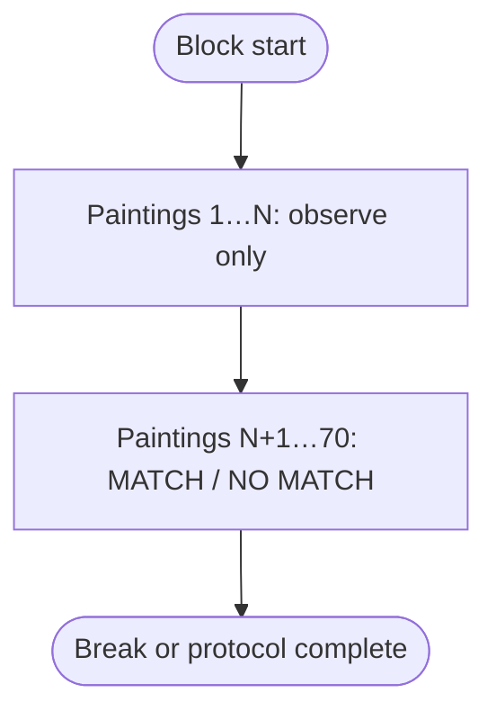
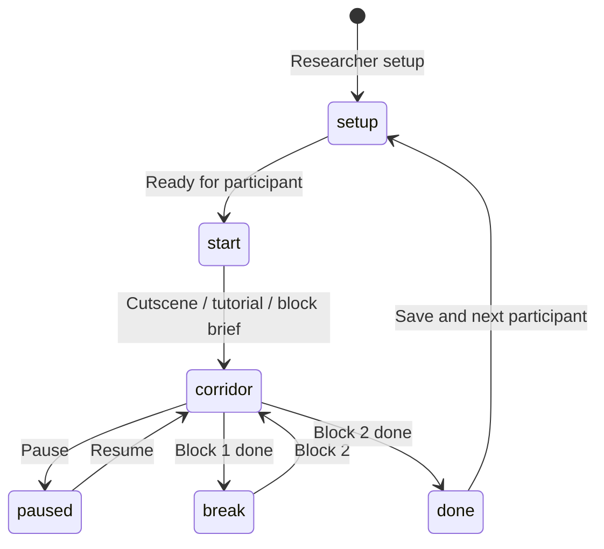

# GLYPHMIND

**GLYPHMIND** is a browser-based **first-person corridor** N-back task. Participants walk an Egyptian-themed hallway; each of **70 paintings** reveals one hieroglyph in visit order. The first **N** paintings are **observe only**; the rest require **MATCH** or **NO MATCH** against the glyph from **N paintings back**.

Offline runtime: open **`index.html`** with **`lib/`** (Three.js, SheetJS) and **`fonts/`** beside it. No build step or network at run time.

---

## Table of contents

1. [Concept overview](#1-concept-overview)
2. [Game mechanics](#2-game-mechanics)
3. [Sequence generation](#3-sequence-generation)
4. [Trial timing and export](#4-trial-timing-and-export)
5. [Participant workflow](#5-participant-workflow)
6. [Research session workflow](#6-research-session-workflow)
7. [Controls](#7-controls)
8. [Stimulus set](#8-stimulus-set)
9. [Data export](#9-data-export)
10. [Technology](#10-technology)
11. [Running locally](#11-running-locally)
12. [License](#12-license)

---

## 1. Concept overview

| Layer | Role |
|--------|------|
| **Presentation** | WebGL corridor (Three.js). First-person walk; glyphs reveal at proximity. |
| **Memory** | N-back on **painting order**: current glyph vs glyph **N steps back** in the sequence. |
| **Structure** | **70 paintings** per block; first **N** observe only; **70 − N** scored responses. |

Constants: **`TOTAL_TRIALS = 70`**, **`MATCH_COUNT = 30`**, **`NON_MATCH_PAINTING_COUNT = 40`**.

Example (1-back): 1 observe + 69 scored → 30 matches + 39 non-matches.<br>
Example (3-back): 3 observe + 67 scored → 30 matches + 37 non-matches.

For exported sequence accounting, observe-only seed paintings are logged with
**`isMatchPainting = 0`**, so every complete block has **30** match paintings and
**40** non-match paintings.

---

## 2. Game mechanics

### 2.1 Trial flow

Paintings are indexed **0 … 69** internally (**1 … 70** in export).



### 2.2 N-back rule (scored paintings only)

For scored painting index **i** (where **i ≥ N**):

- **Current:** `seq[i]`
- **Compare to:** `seq[i − N]`
- **MATCH** if equal, **NO MATCH** if different.

Observe paintings **1 … N** seed the chain; they are visible in the corridor but do not take a response.

### 2.3 Responses

| Action | Code | Desktop |
|--------|------|---------|
| MATCH | `Resp = 1` | **F**, **Space**, left click |
| NO MATCH | `Resp = 2` | **J**, right click |

**CRESP** follows ground truth; **ACC = 1** when **Resp === CRESP**.

Touch: joystick, drag to look, **MATCH** / **NO MATCH** buttons (not canvas tap).

---

## 3. Sequence generation

Each block calls **`genSeqBlock(N, sequenceSeed)`**:

- Returns **`seq`** of length **70** (one glyph index per painting).
- Uses a per-block **`sequenceSeed`** so the randomized sequence can be replayed.
- Paintings **1 … N** (internal `seq[0] … seq[N−1]`): random glyphs, observe only.
- Paintings **N+1 … 70** (internal `seq[N] … seq[69]`): filled so exactly **30** are true N-back matches; the rest are forced non-matches.

The corridor always builds **70** panels (`buildLevel`); there is no separate hidden seed or 71st painting.

---

## 4. Trial timing and export

- **RT:** response time minus reveal time (scored trials only).
- **RSI:** ms from anchor to this stimulus onset.
  - Observe rows: **`prior_stimulus_onset`** (or **`none`** for painting 1).
  - First scored painting: **`prior_stimulus_onset`** after last observe.
  - Later scored: **`prior_response`**.

---

## 5. Participant workflow



- **Researcher setup:** PID (required), session, condition, phase, block order (1→3 or 3→1).
- **Participant start:** BEGIN → optional cutscene/tutorial → block instruction overlay → corridor.
- **Pause:** export, restart block, controls, return to setup (with discard confirm if data in memory).

---

## 6. Research session workflow

1. Enter PID and settings → **Ready for participant** → participant **BEGIN**.
2. Block 1 (e.g. 1-back) → break screen → **Continue to block 2** (e.g. 3-back).
3. Protocol complete → **Export data** (backup) or **Save & next participant** (exports both blocks, clears PID, returns to setup).

Block order is fixed at setup (**1→3** or **3→1**). Export filename includes both N levels when applicable (e.g. `n1+3`).

Details: **[README_OFFLINE.md](./README_OFFLINE.md)**.

---

## 7. Controls

| Action | Desktop |
|--------|---------|
| Move | **W A S D** / arrows; **Shift** sprint |
| Look | Mouse (pointer lock after engaging canvas) |
| MATCH | **F**, **Space**, left click |
| NO MATCH | **J**, right click |
| Pause | **Esc** |

**Touch:** joystick, drag to look, on-screen MATCH / NO MATCH, pause button.

---

## 8. Stimulus set

12 Egyptian hieroglyphs (Noto font in app). Export uses Gardiner IDs and Unicode columns — see in-app **`GLYPHS`** and spreadsheet **Stimulus** / **Target** fields.

---

## 9. Data export

**Trials** sheet: one row per painting reveal per block (**70 rows/block**).

| `trialType` | Meaning |
|-------------|---------|
| `warmup` | Observe only; no Resp/ACC |
| `scored` | MATCH/NO MATCH response logged |

Key columns: `block`, `N`, `sequenceSeed`, `isMatchPainting`, `painting`, `trial`, `tc`, `CRESP`, `Resp`, `ACC`, `RT`, `RSI`, `rsiAnchor`, stimulus/target IDs.

**Meta** sheet: design constants, block order, row counts, sequence seed/count checks, RSI notes.

**Save & next participant** (after both blocks): one `.xlsx` with all rows, then session reset for a new PID.

---

## 10. Technology

| Piece | Role |
|-------|------|
| Three.js (`lib/three.min.js`) | Corridor rendering |
| SheetJS (`lib/xlsx.full.min.js`) | `.xlsx` export |
| Bundled fonts (`fonts/`) | UI + hieroglyphs |

---

## 11. Running locally

1. Keep **`index.html`**, **`lib/`**, and **`fonts/`** together.
2. Open **`index.html`** in Chrome, Firefox, Safari, or Edge.

Optional local server if `file://` is blocked:

```bash
python3 -m http.server 8080
```

**Logic check** (no browser):

```bash
node scripts/verify-logic.mjs
```

---

## 12. License

Add a **`LICENSE`** before redistribution if needed. Font notice: **`fonts/FONT_NOTICE.txt`**.
