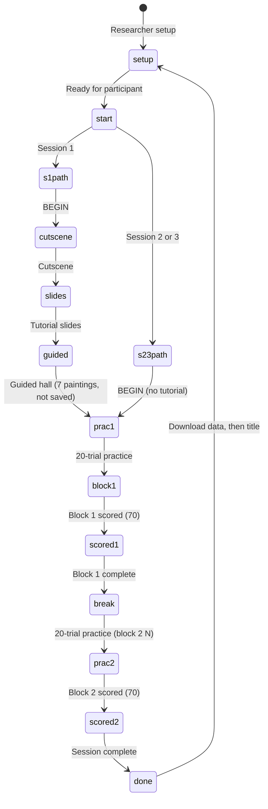

# GLYPHMIND

**GLYPHMIND** is a browser-based **first-person corridor** N-back task. Participants walk an Egyptian-themed hallway; each painting reveals one hieroglyph in visit order. The first **N** paintings are **observe only**; the rest require **MATCH** or **NO MATCH** against the glyph from **N paintings back**.

Offline runtime: open **`index.html`** with **`lib/`** (Three.js, SheetJS) and **`fonts/`** beside it. No build step or network at run time.

---

## Table of contents

1. [Concept overview](#1-concept-overview)
2. [Game mechanics](#2-game-mechanics)
3. [Sequence generation](#3-sequence-generation)
4. [Trial timing and export](#4-trial-timing-and-export)
5. [Participant workflow](#5-participant-workflow)
6. [Research session workflow](#6-research-session-workflow)
7. [Controls and accessibility](#7-controls-and-accessibility)
8. [Stimulus set](#8-stimulus-set)
9. [Data export](#9-data-export)
10. [Technology](#10-technology)
11. [Running locally and validation](#11-running-locally-and-validation)
12. [License](#12-license)

---

## 1. Concept overview

| Layer | Role |
|--------|------|
| **Presentation** | WebGL corridor (Three.js). First-person walk; glyphs reveal at proximity. |
| **Memory** | N-back on **painting order**: current glyph vs glyph **N steps back** in the sequence. |
| **Structure** | **70 paintings** per scored block; first **N** observe only; **70 − N** scored responses. |

Constants: **`TOTAL_TRIALS = 70`**, **`PRACTICE_TRIALS = 20`**, **`MATCH_COUNT = 30`**, **`NON_MATCH_PAINTING_COUNT = 40`**.

Each **scored** block is exactly **70 paintings** in the corridor and in the export. The first **N** are **observe only** and are **included in those 70**. Before each scored block, participants run a **20-painting practice block** at the same N-back level (logged as `practice` / `practice_warmup`).

| Block part | Count | Paintings | Notes |
|------------|------:|-----------|--------|
| Observe-only | **N** | **1 … N** | Watch only; no MATCH / NO MATCH response |
| Scored | **70 − N** | **N+1 … 70** | Compare current glyph to the one **N steps back** |
| True N-back matches (scored) | **30** | among scored rows | Ground truth: `Stimulus === Target` |
| Scored non-matches | **70 − N − 30** | among scored rows | Forced non-match at sequence generation |

**Export accounting (`isMatchPainting`)** on scored/warmup rows: every complete scored block has **30** rows with `isMatchPainting = 1` and **40** with `isMatchPainting = 0` (see section 1 in prior builds — observe rows always log `0`).

For match/non-match analysis, filter **`trialType === "scored"`** or use **`CRESP`**.

---

## 2. Game mechanics

### 2.1 Trial flow (scored block)

Paintings are indexed **0 … 69** internally (**1 … 70** in export).


### 2.2 N-back rule (scored paintings only)

For scored painting index **i** (where **i ≥ N**):

- **Current:** `seq[i]`
- **Compare to:** `seq[i − N]`
- **MATCH** if equal, **NO MATCH** if different.

Observe paintings **1 … N** seed the chain; they are visible in the corridor but do not take a response.

### 2.3 Responses

| Action | Code | Desktop |
|--------|------|---------|
| MATCH | `Resp = 1` | left click |
| NO MATCH | `Resp = 2` | right click |

**CRESP** follows ground truth; **ACC = 1** when **Resp === CRESP**.

Touch: joystick, drag to look, **MATCH** / **NO MATCH** buttons (not canvas tap).

---

## 3. Sequence generation

Each block calls **`genSeqBlock(N, sequenceSeed)`** (or the practice-length variant for 20-trial practice):

- Returns **`seq`** of length **70** (or **20** for practice).
- Uses a per-block **`sequenceSeed`** so the randomized sequence can be replayed.
- Paintings **1 … N**: random glyphs, observe only.
- Remaining paintings: filled so match counts scale with block length (30 matches in a full 70-painting scored block).

The corridor builds one panel per painting in the active sequence. The **guided tutorial hall** (Session 1 only, 7 paintings) uses a fixed teaching sequence and is **not logged**.

---

## 4. Trial timing and export

- **RT:** milliseconds from glyph reveal to response (scored and practice trials). Pause time during an unanswered painting is excluded from RT.
- **RSI:** milliseconds from the timing anchor to this painting's reveal.
  - Painting 1 (observe): anchor **`none`**, RSI is typically `0`.
  - Observe paintings 2…N: anchor **`prior_stimulus_onset`**.
  - First scored painting (N+1): anchor **`prior_stimulus_onset`**.
  - Later scored paintings: anchor **`prior_response`**.
- **Row logging:** each answerable painting creates one export row at reveal (empty `Resp` until answered), then updates on response.
- **Block completion:** the participant must answer every scored painting before the block ends.

---

## 5. Participant workflow



### 5.1 Researcher setup (title screen)

- **Participant ID** (required): two-digit numeric ID, zero-padded (e.g. `01`, `02`). Typing `1` becomes `01` on blur or when continuing.
- **Session:** **`1`**, **`2`**, or **`3`** (buttons, not free text). Stored in export as `Session` = `1`, `2`, or `3`.
- **Stimulation:** `anodal`, `cathodal`, or `sham`.
- **Block order:** `1-BACK → 3-BACK` or `3-BACK → 1-BACK` (fixed for the whole run).
- **Ready for participant:** opens the participant start screen (PID + session badge).

### 5.2 Session paths

| Session | On BEGIN | Tutorial | Practice + scored blocks |
|--------:|----------|----------|---------------------------|
| **1** | Cutscene → Khenu slides → guided hall (7 paintings) | Required; no skip | 20-trial practice → 70 scored, ×2 blocks |
| **2** | Straight to first practice block | Skipped entirely | Same practice + scored structure |
| **3** | Straight to first practice block | Skipped entirely | Same practice + scored structure |

The **guided hall** and **tutorial slides** are never written to the export file.

### 5.3 Block transitions

After block 1 scored, the break screen shows block 1 stats and a short line about the next **20-trial practice** and block 2. **Continue** starts block 2 practice (no full instruction overlay on the break screen).

### 5.4 In-corridor HUD

- **N-BACK** level and painting progress.
- **`· OBSERVE`** while on watch-only paintings.
- Running accuracy on answered trials in the current block.

### 5.5 Pause menu (Esc)

| Action | Effect |
|--------|--------|
| **Resume** | Continue; RT/RSI timers exclude pause duration |
| **Controls** | Re-open tutorial slides (reference only) |
| **Accessibility** | High contrast, HUD glyph labels, larger crosshair, low mouse sensitivity, mute, longer painting glow |
| **Restart block** | Drop current block scored rows and replay (practice rows for that block are kept when applicable) |
| **Back to title** | Warns if session data has not been downloaded from the end screen |

There is **no download button** in the pause menu. Trial rows are mirrored to **`sessionStorage`** during play so a reload can restore an in-progress session when a full snapshot exists.

---

## 6. Research session workflow

1. Enter **PID** (`01`, …), **session** (`1` / `2` / `3`), stimulation, and block order → **Ready for participant**.
2. Participant **BEGIN** → session-specific path (section 5.2).
3. Per block: **20-trial practice** (saved) → **70-trial scored block** (saved).
4. After block 2 scored → **Session complete** screen → **DOWNLOAD DATA** (only download point in the app).
5. Use **Title screen** to start the next participant after download (or confirm discard if download was skipped).

Lab operator checklist: **[GLYPHMIND_Game_Run_Protocol.md](./GLYPHMIND_Game_Run_Protocol.md)** (update that doc if it still references older export buttons).

---

## 7. Controls and accessibility

### 7.1 Game controls

| Action | Desktop |
|--------|---------|
| Move | **W A S D** / arrows; **Shift** sprint |
| Look | Mouse (pointer lock after engaging canvas) |
| MATCH | left click |
| NO MATCH | right click |
| Pause | **Esc** |

**Touch:** joystick, drag to look, on-screen MATCH / NO MATCH, pause button.

**Tutorial / block overlays:** **Space** or **Enter** to dismiss or advance where shown.

### 7.2 Accessibility (pause → Accessibility)

| Toggle | Effect |
|--------|--------|
| High contrast | Stronger UI contrast |
| Show glyph labels on HUD | Gardiner-style IDs on HUD where applicable |
| Larger crosshair | Bigger on-screen aim ring |
| Mouse sensitivity (low) | Reduced look sensitivity |
| Mute sounds | Disables procedural SFX |
| Longer glow (5s) | Painting highlight stays visible longer (default 2s) |

Settings apply to the current browser session only (not saved to export).

### 7.3 Audio

- **Cutscene:** no background music; optional short glitch beep during the transition.
- **Corridor:** lightweight SFX for panel reveal, match/no-match, correct/wrong feedback unless muted.

---

## 8. Stimulus set

12 Egyptian hieroglyphs rendered with **Noto Sans Egyptian Hieroglyphs** in the app. Export columns **Stimulus** / **Target** use Gardiner IDs; Unicode appears in the spreadsheet as well.

| Index | Glyph | Gardiner ID | Name | Unicode |
|------:|:-----:|:-----------:|------|:-------:|
| 0 | 𓂀 | D010 | Eye (D10) | U+13080 |
| 1 | 𓂋 | D021 | Mouth (D21) | U+1308B |
| 2 | 𓂝 | D036 | Hand (D36) | U+1309D |
| 3 | 𓅓 | G017 | Owl (G17) | U+13153 |
| 4 | 𓆄 | H006 | Feather (H6) | U+13184 |
| 5 | 𓆑 | I009 | Horned viper (I9) | U+13191 |
| 6 | 𓆓 | I010 | Cobra (I10) | U+13193 |
| 7 | 𓈖 | N035 | Water (N35) | U+13216 |
| 8 | 𓇼 | N014 | Star (N14) | U+131FC |
| 9 | 𓏏 | X001 | Loaf (X1) | U+133CF |
| 10 | 𓇳 | N005 | Sun (N5) | U+131F3 |
| 11 | 𓊽 | R011 | Djed pillar (R11) | U+132BD |

Sequence indices **0–11** map to these rows (see in-app **`GLYPHS`**).

---

## 9. Data export

Each export is one `.xlsx` workbook with **Trials** and **Meta** sheets. Download is available **only on the session-complete screen** after both scored blocks finish.

### 9.1 Trials sheet

A full two-block session produces **180 rows** (90 per block: **20 practice** + **70 scored/warmup**).

| `trialType` | Meaning |
|-------------|---------|
| `practice_warmup` | Observe-only rows in a 20-trial practice block |
| `practice` | Answered practice trials (same columns as scored) |
| `warmup` | Observe-only rows in a 70-trial scored block |
| `scored` | N-back trial in a scored block |

| Column | Meaning |
|--------|---------|
| `PID`, `Session`, `Condition` | From setup (`01`, session `1`–`3`, `anodal` / `cathodal` / `sham`) |
| `sessionStartISO`, `exportedAt` | Session and export timestamps |
| `block`, `N` | Block index (1 or 2) and N-back level for that block |
| `sequenceSeed` | Per-block seed |
| `painting`, `trial` | Painting number within that block's sequence |
| `isMatchPainting`, `tc`, `CRESP`, `Resp`, `ACC`, `RT`, `RSI`, `rsiAnchor` | Timing and response fields |
| `Stimulus`, `Target`, … | Gardiner IDs and metadata |

Tutorial / guided-hall trials are **not** exported.

### 9.2 Meta sheet

Design constants and QC counts, including `practicePaintingsPerBlock` (= 20), `paintingsPerBlock` (= 70), per-block seeds, row counts, and `trialType` notes.

### 9.3 Analysis notes

- Filter **`trialType === "scored"`** for primary accuracy and RT metrics.
- Practice rows (`practice` / `practice_warmup`) can be analysed separately or excluded.
- **`hits` / `misses` / `falseAlarms` / `correctRejections`** on the results screen match export coding (`tc` vs `Resp`).

### 9.4 Download

| When | Where | Effect |
|------|--------|--------|
| Session complete | **DOWNLOAD DATA** on final results screen | Saves `.xlsx`; sets exported flag; session stays in memory until you return to title |

Example filename:

`glyphmind_01_s2_anodal_1to3_2026-06-08_152447.xlsx`

Pattern: `glyphmind_{PID}_s{session}_{condition}_{order}_{date}_{time}.xlsx`

Closing the tab before download triggers a browser warning if trial data exists and has not been exported. In-session **`sessionStorage`** snapshots help recover after an accidental reload.

---

## 10. Technology

| Piece | Role |
|-------|------|
| Three.js (`lib/three.min.js`) | Corridor rendering |
| SheetJS (`lib/xlsx.full.min.js`) | `.xlsx` export |
| Bundled fonts (`fonts/`) | UI + hieroglyphs |

---

## 11. Running locally and validation

### 11.1 Run the task

1. Keep **`index.html`**, **`lib/`**, and **`fonts/`** together.
2. Open **`index.html`** in Chrome, Firefox, Safari, or Edge.

Optional local server if `file://` is blocked:

```bash
python3 -m http.server 8080
```

### 11.2 Logic check (no browser)

Mirrors in-app sequence generation and export accounting:

```bash
node scripts/verify-logic.mjs
node scripts/verify-session-data.mjs
```

Expect: `All checks passed.` / `All session data checks passed.` (180 rows for a full simulated session).

### 11.3 Export audit (participant `.xlsx`)

Validates a saved workbook against the same rules as the app:

```bash
node scripts/audit-export.mjs path/to/export.xlsx
node scripts/audit-export.mjs path/to/export.xlsx --strict
```

Checks include row counts, N-back ground truth, `rsiAnchor`, Meta vs Trials consistency, and **`sequenceSeed` replay**.

Use **`--strict`** to fail if any scored row is missing `Resp`.

Shared implementation: `scripts/glyphmind-core.mjs`.

---

## 12. License

Add a **`LICENSE`** before redistribution if needed. Font notice: **`fonts/FONT_NOTICE.txt`**.
