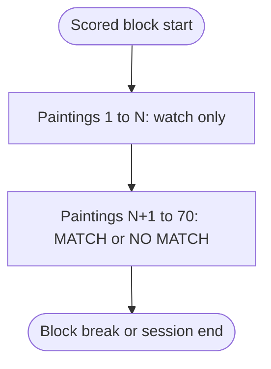
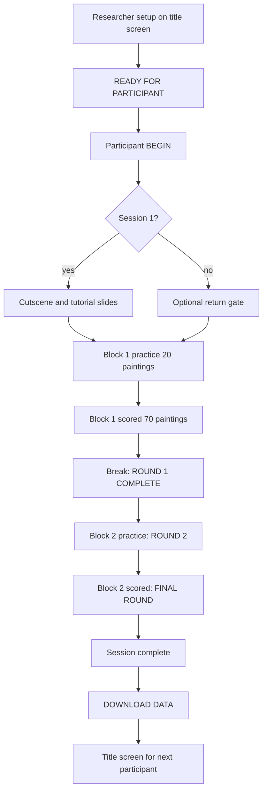
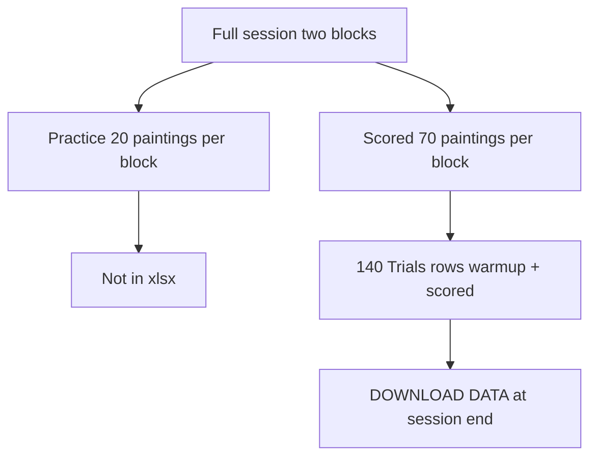

# GLYPHMIND

GLYPHMIND is a browser N-back task in a first-person Egyptian corridor. Each painting shows one hieroglyph in visit order. The first **N** paintings are watch-only. After that, the participant answers **MATCH** or **NO MATCH** by comparing the current glyph to the one from **N paintings back**.

Open **`index.html`** with **`lib/`** (Three.js, SheetJS) and **`fonts/`** in the same folder. No build step. No network at run time.

## What you get per session

- Two scored blocks (70 paintings each, exported).
- One 20-painting practice run before each scored block (on screen only, not in the export file).
- Session 1: cutscene, then slide tutorial, then practice and scored blocks.
- Sessions 2 and 3: skip cutscene and slides; go straight to practice.

Block order is fixed for the run: **1-back then 3-back**, or **3-back then 1-back**.

## Scored block layout

Constants: `TOTAL_TRIALS = 70`, `PRACTICE_TRIALS = 20`, `MATCH_COUNT = 30`.

| Part | Count | Paintings |
|------|------:|-----------|
| Watch-only | N | 1 through N |
| Scored | 70 − N | N+1 through 70 |
| True N-back matches (among all 70) | 30 | set at sequence generation |

The export holds **140 rows** for a full session (70 per block): `warmup` rows for the watch-only paintings, then `scored` rows for the rest.

Practice warm-up accuracy appears on transition screens. It is **not** written to the spreadsheet.

For analysis, use `trialType === "scored"` and `Resp` in {1, 2}. Block accuracy in the HUD is correct answers divided by answered scored trials (watch-only paintings are excluded).



## N-back rule

For scored painting index **i** (where **i ≥ N**):

- Current glyph: `seq[i]`
- Compare to: `seq[i − N]`
- Same glyph: **MATCH** (left click). Different: **NO MATCH** (right click).

`CRESP` stores the correct code (1 = match, 2 = no match). `ACC` is 1 when `Resp === CRESP`.

Desktop build: mouse only. Touch buttons are not implemented yet.

## Sequence generation

Each scored block calls `genSeqBlock(N, sequenceSeed)`:

- 70 glyphs in the corridor sequence.
- First N are random observe glyphs.
- Remaining positions are filled to hit 30 matches across the full 70-painting block.
- `sequenceSeed` is stored on the **Meta** sheet (`block1_sequenceSeed`, `block2_sequenceSeed`) so the sequence can be replayed offline.

Practice uses the same generator with 20 trials. Those trials are not exported.

## Timing fields

- **RT:** milliseconds from glyph reveal to the participant's click. Pause time during an unanswered painting is excluded.
- **RSI:** milliseconds from the prior event to this painting's reveal (walking time between paintings counts).
- Scored rows are created at reveal with empty `Resp`, then updated when the participant answers.
- The participant must answer every scored painting before the block ends. Only one click per painting is logged.

## Researcher setup (title screen)

1. Enter **Participant ID** (required).
2. Pick **Session** `1`, `2`, or `3` (stored as `"1"`, `"2"`, `"3"` in the export).
3. Pick **Stimulation:** anodal, cathodal, or sham. Confirm the correct button is lit before the participant starts (default is anodal).
4. Pick **Block order:** 1-BACK → 3-BACK or 3-BACK → 1-BACK.
5. Click **READY FOR PARTICIPANT**.

Returning to the title screen clears the participant ID field.

## Participant flow



Gate labels worth noting:

- Block 1 break after scored block 1: **ROUND 1 COMPLETE**
- Block 2 practice warm-up: **ROUND 2**
- Block 2 scored intro: **FINAL ROUND**

Tutorial slides and practice are never exported.

## Pause menu (Esc)

| Action | What it does |
|--------|----------------|
| Resume | Continue; pause time is excluded from RT on the active painting |
| Controls | Re-open tutorial slides |
| Accessibility | Contrast, HUD labels, crosshair, mouse sensitivity, mute, longer glow |
| Restart block | Drop scored + warmup rows for the current block and replay it |
| Back to title | Warns if data were not downloaded |

There is no download button in the pause menu. Trial rows are copied to `sessionStorage` during play. If the tab reloads, a recovery banner may offer **DOWNLOAD DATA**. Do not dismiss that banner without saving.

## Data export

Download is only on the **session complete** screen after both scored blocks finish.



**Trials sheet columns:** `PID`, `Session`, `Condition`, `block`, `nback`, `trialType`, `trial`, `isMatch`, `CRESP`, `Resp`, `ACC`, `runningAccuracy`, `RT`, `RSI`, `StimulusName`, `StimulusChar`.

**Meta sheet:** timestamps, `blockOrder_key`, row counts, per-block seeds, QC counts.

Auto filename example: `BSVG_STANDARD_SESSION2_01.xlsx`

Rename in the lab if you need condition, block order, or date in the filename.

## Stimulus set

12 hieroglyphs (Noto Sans Egyptian Hieroglyphs in the app). Indices 0 through 11 map to the in-app `GLYPHS` table. Export uses `StimulusName` and `StimulusChar`.

## Controls

| Action | Desktop |
|--------|---------|
| Move | W A S D or arrows; Shift to sprint |
| Look | Mouse (pointer lock on the canvas) |
| MATCH | Left click |
| NO MATCH | Right click |
| Pause | Esc |

Space and Enter advance tutorial slides and dismiss instruction gates only.

## Validation

Requires [Node.js](https://nodejs.org/) for the scripts below. The game itself runs in the browser with no install step.

```bash
node scripts/verify-logic.mjs
node scripts/verify-session-data.mjs
node scripts/audit-export.mjs path/to/export.xlsx --strict
```

A complete session should pass with **140 rows** and zero pending scored rows under `--strict`.

Optional local server if `file://` is blocked:

```bash
python3 -m http.server 8080
```

## Operator checklist

See **[GLYPHMIND_Game_Run_Protocol.md](./GLYPHMIND_Game_Run_Protocol.md)** for the full run sheet.

## Technology

- Three.js (`lib/three.min.js`) for the corridor
- SheetJS (`lib/xlsx.full.min.js`) for export
- Bundled fonts in `fonts/` (see `fonts/FONT_NOTICE.txt`)
