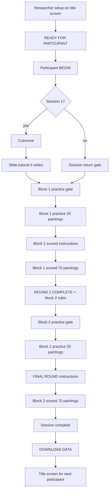
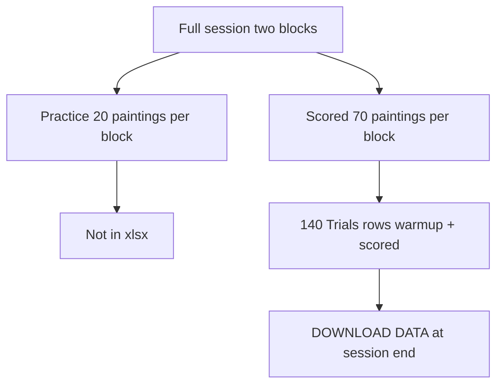

# GLYPHMIND

GLYPHMIND is a browser N-back task in a first-person Egyptian corridor. Each painting shows one hieroglyph in visit order. The first **N** paintings are watch-only. After that, the participant answers **MATCH** or **NO MATCH** by comparing the current glyph to the one from **N paintings back**.

Open **`index.html`** with **`lib/`** (Three.js, SheetJS) and **`fonts/`** in the same folder. No build step. No network at run time.

## What you get per session

- Two scored blocks (70 paintings each, exported).
- One 20-painting practice run before each scored block (on screen only, not in the export file).
- **Session 1:** cutscene, then slide tutorial, then block 1 practice, block 1 scored instructions, block 1 scored, block 2 transition, block 2 practice, block 2 scored instructions, block 2 scored, then download.
- **Sessions 2 and 3:** skip cutscene and slides; optional return gate, then same block loop.

Block order is fixed for the run: **1-back then 3-back**, or **3-back then 1-back**.

The task runs **continuously** once started. There is no pause menu.

## Scored block layout

Constants: `TOTAL_TRIALS = 70`, `PRACTICE_TRIALS = 20`, `MATCH_COUNT = 30`.

| Part | Count | Paintings |
|------|------:|-----------|
| Watch-only | N | 1 through N |
| Scored | 70 - N | N+1 through 70 |
| True N-back matches (among all 70) | 30 | set at sequence generation |

The export holds **140 rows** for a full session (70 per block): `warmup` rows for the watch-only paintings, then `scored` rows for the rest.

Practice warm-up accuracy appears on transition screens. It is **not** written to the spreadsheet.

For analysis, use `trialType === "scored"` and `Resp` in {1, 2}. Block accuracy in the HUD is correct answers divided by answered scored trials (watch-only paintings are excluded).


## N-back rule

For scored painting index **i** (where **i >= N**):

- Current glyph: `seq[i]`
- Compare to: `seq[i - N]`
- Same glyph: **MATCH** (left click). Different: **NO MATCH** (right click).

`CRESP` stores the correct code (1 = match, 2 = no match). `ACC` is 1 when `Resp === CRESP`.

Desktop build: mouse only. Touch buttons are not implemented yet.

## Sequence generation

Each scored block calls `genSeqBlock(N, sequenceSeed)`:

- 70 glyphs in the corridor sequence.
- First N are random observe glyphs.
- Remaining positions are filled to hit 30 matches across the full 70-painting block.
- `sequenceSeed` is stored on the **Meta** sheet (`block1_sequenceSeed`, `block2_sequenceSeed`) so the sequence can be replayed offline.

Practice uses the same generator with 20 trials. Those trials are not exported.

## Timing fields

Timing helpers live in `index.html` and `scripts/glyphmind-core.mjs` (`reactionTimeMs`, `interStimulusInterval`, `clickPerfNow`).

### Glyph reveal (onset)

A painting reveals when the camera is within **2.85 m** (3D distance) of the panel mesh. The glyph glows, `revealTime` is stamped, and scored trials accept clicks in the same turn (no deferred arming).

### RT (reaction time)

**Definition:** time from painting revealed to button clicked.

**Code:** `RT = clickTime - revealTime`

- `revealTime` = when the glyph appears (after the frame is painted).
- `clickTime` = mouse click timestamp.

### RSI (response-stimulus interval)

**Definition:** time from button clicked to next painting shown.

**Code:** `RSI = nextRevealTime - lastClickTime`

| Situation | What RSI measures |
|-----------|-------------------|
| Scored trial (after you have clicked at least once in the block) | last click to this painting shown |
| Watch-only trials / first scored trial (no prior click yet) | previous painting shown to this painting shown (walk time only) |
| First painting in block | `0` |

## Researcher setup (title screen)

1. Enter **Participant ID** (required).
2. Pick **Session** `1`, `2`, or `3` (stored as `"1"`, `"2"`, `"3"` in the export).
3. Pick **Stimulation:** anodal, cathodal, or sham. Confirm the correct button is lit before the participant starts (default is anodal).
4. Pick **Block order:** 1-BACK then 3-BACK or 3-BACK then 1-BACK.
5. Optional: **ACCESSIBILITY** (contrast, HUD labels, crosshair size, mouse sensitivity, mute, longer glyph glow).
6. Click **READY FOR PARTICIPANT**.

Returning to the title screen clears the participant ID field.

## Participant flow



Gate labels worth noting:

- Block 1 practice (session 1): **PRACTICE ROUND**
- Block 1 scored intro: **MAIN ROUND**
- After block 1 scored: **ROUND 1 COMPLETE** (includes block 2 rules)
- Block 2 practice: **PRACTICE ROUND** / **ROUND 2**
- Block 2 scored intro: **FINAL ROUND**

### Session 1 slide tutorial (not exported)

Six slides, order-specific:

| Slide | Content |
|-------|---------|
| 1 | Welcome, corridor walk, block order pill |
| 2 | Watch-only paintings, OBSERVE HUD |
| 3 | 1-back and 3-back rules, MATCH / NO MATCH |
| 4-5 | Quizzes: 1-then-3 order uses 2-painting 1-back quiz; 3-then-1 order uses 4-painting 3-back quiz |
| 6 | Walk / look / click controls |

Final button label: **CONTINUE TO PRACTICE** (with arrow on screen).

Tutorial slides and practice are never exported.

## Accessibility

Open from the title screen **ACCESSIBILITY** button (researcher setup). During play, press **Esc** to close the accessibility panel if it is open.

| Option | Effect |
|--------|--------|
| High contrast | Stronger UI contrast |
| Show glyph labels on HUD | Text labels beside glyphs |
| Larger crosshair | Bigger aim ring |
| Mouse sensitivity (low) | Reduced look speed |
| Mute sounds | Disables SFX and corridor ambient |
| Longer glow (5 s) | Glyph stays highlighted longer (default 2 s) |

## Data recovery

Trial rows are copied to `sessionStorage` during play. If the tab reloads, a recovery banner offers **DOWNLOAD DATA** only; it does **not** resume the task. Incomplete recovery files receive a `_PARTIAL` filename suffix and `exportStatus = partial` on the Meta sheet.

## Data export

Download is only on the **session complete** screen after both scored blocks finish.



**Trials sheet columns:** `PID`, `Session`, `Condition`, `block`, `nback`, `trialType`, `trial`, `isMatch`, `CRESP`, `Resp`, `ACC`, `runningAccuracy`, `RT`, `RSI`, `StimulusName`, `StimulusChar`.

**Meta sheet:** timestamps, `blockOrder_key`, row counts, per-block seeds, QC counts.

Auto filename example: `BSVG_GLYPHMIND_SESSION2_01.xlsx`

An incomplete recovery export is named `BSVG_GLYPHMIND_SESSION2_01_PARTIAL.xlsx`.

Rename in the lab if you need condition, block order, or date in the filename.

## Stimulus set

12 hieroglyphs (Noto Sans Egyptian Hieroglyphs in the app). Indices 0 through 11 map to the in-app `GLYPHS` table. Export uses `StimulusName` and `StimulusChar`.

## Controls

| Action | Desktop |
|--------|---------|
| Move | W A S D or arrows; Shift to sprint |
| Look | Mouse (pointer lock on the canvas) |
| MATCH | Left click |
| NO MATCH | Right click |
| Close accessibility panel | Esc (when accessibility is open) |

Space and Enter advance tutorial slides and dismiss instruction gates only. Keyboard keys do not answer trials.

### Staff shortcuts (not shown to participants)

| Key | When | Effect |
|-----|------|--------|
| **Y** | Session 1 cutscene | Skip cutscene only; slide tutorial still runs |

## Validation

Requires [Node.js](https://nodejs.org/) for the scripts below. The game itself runs in the browser with no install step.

```bash
node scripts/verify-logic.mjs
node scripts/verify-session-data.mjs
node scripts/audit-export.mjs path/to/export.xlsx --strict
```

A complete session should pass with **140 rows** and zero pending scored rows under `--strict`.

Optional local server if `file://` is blocked:

```bash
python3 -m http.server 8080
```

## Operator checklist

See **[GLYPHMIND_Game_Run_Protocol.md](./GLYPHMIND_Game_Run_Protocol.md)** for the full run sheet.

## Technology

- Three.js (`lib/three.min.js`) for the corridor
- SheetJS (`lib/xlsx.full.min.js`) for export
- Bundled fonts in `fonts/` (see `fonts/FONT_NOTICE.txt`)
